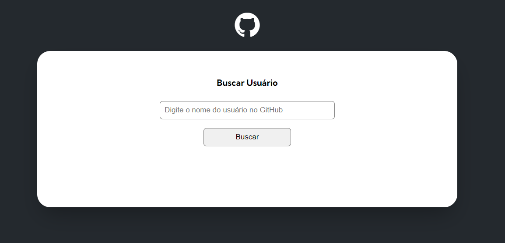

# Desafio GitHub API

## Bem-vindo! 👋

Valeu por checkar o meu desafio 😊

**Para esse desafio é interessante ter uma noção básica em CSS, HTML e JS.**

## O desafio

O desafio é construir uma página interativa que busca as informações dos usuários do GitHub e mostra na tela algumas informações:

- Avatar do usuário, nome, bio, seguidores e quantas pessoas o usuário segue;
- Repositórios do usuário (10);
- Eventos recentes;

Para isso é necessário utilizar a API do github para buscar essas informações.
